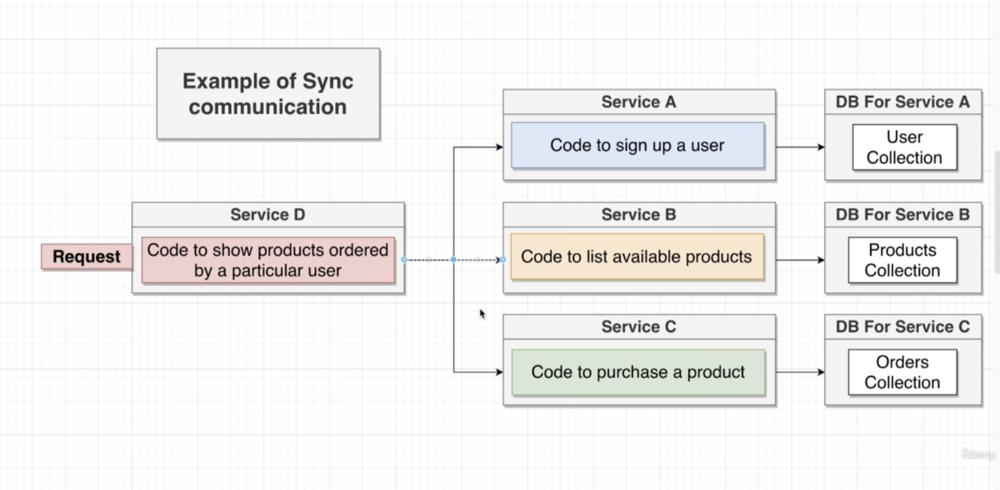
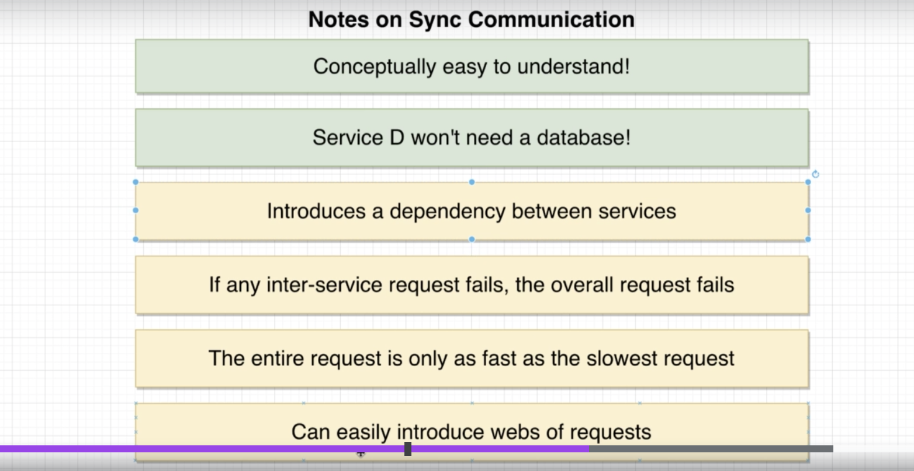
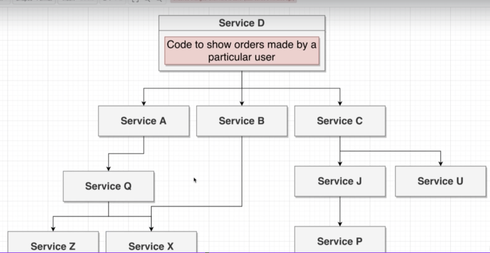
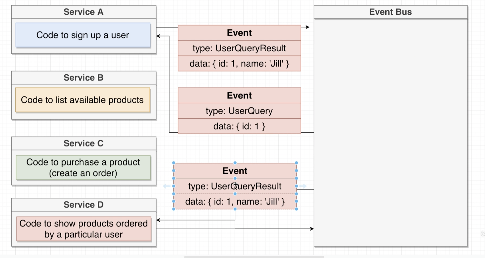
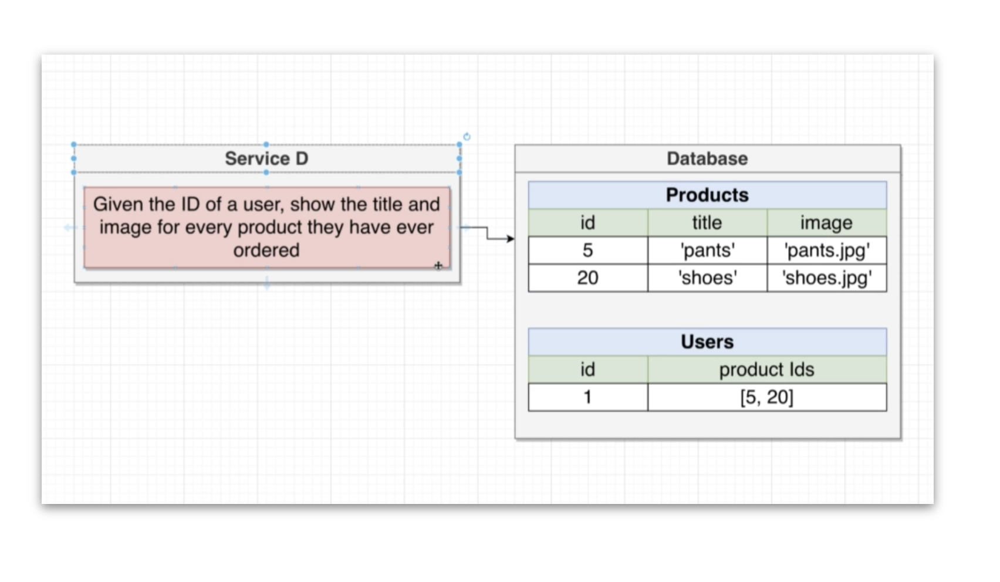
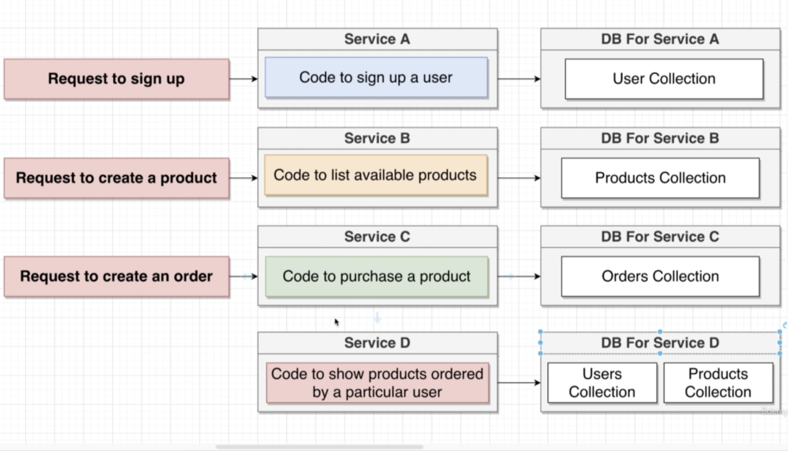

# Micro-Service Notes

A monolithic structure has all the routing, middleware, business logic, and database access for **all the features of an application**

Micro-service structures contains all the routing, middleware, business logic, and database **to implement one feature of the application**.

The nice part of this setup is one service can be down without taking the entire application down. We can also isolate and implement feature work on one part of the application w/ out impacting the other parts of it

## The Big Challenge

Data Management between services - communicating data between services - which is a huge obstacle for implementing micro-service based design.

## Storing and Accessing Data in MS systems

The diagram above has a sep db for each service

This sounds super strange....

One service will NEVER reach into another services DB...

Two Rules

Each Service gets its own db

Services never access each others dbs

The reason for this, among others, is that anything going wrong with one db would impact multiple services

Also, scaling the services and db would be hard if there was mixed dependencies there

Also, the schema might change - which would only impact the service in question if we followed database per schema patterns

Example of what not to do in a micro-service based structure

and finally, some services operate better with different types of databases

## Why DB between services is really challenging

Lets use a simple e-commerce app example

what would this look like as a monolith?

what would this look like as a micro-service?

If we wanted to add in a new feature - say orders by user, how could we implement it without having our new service talk to the db collection for users & orders???

This is the huge problem we have to solve for with micro-services

## Sync and Async (not the JavaScript terms)

## Synchronous Communication Style

Synchronous - services communication - communication directly with request (rest or some other protocol)

;

In the above example, service D isn't communicating directly with the databases for the other services, instead, its making requests to and getting responses from those services directly - in turn, those services interface w/ the database

### Upside and Downside to sync communication

;

Downsides - dependencies could cause issues.... we're only going to be as fast as the slowest request....

Web of Dependencies - we don't necessarily know what some other service is doing - especially in an enterprise env.

;

## Asynchronous Communication Style

Two methods, the first one isn't so great but its important to know anyways

### Event Bus

;

the problem w/ this event bus system is it shares all the problems as the sync style example...

We shouldn't see this type of async setup much in the corporate world for the above reasons

### Database for cross service needs

We can have Service A tell service D whenever a user signs up... but, we have to do it in a way where service A won't fail if service D isn't up.

So how are we going to solve this??

### Pros and Cons

**Pro's**

Service D has zero dependencies on other services

Extremity fast - info available right away

**Con's**

Duplication of Data (not the whole record; just the data needed) - extra storage - but... storage costs are kinda cheap

we will have to handle stale data

Harder to understand...
